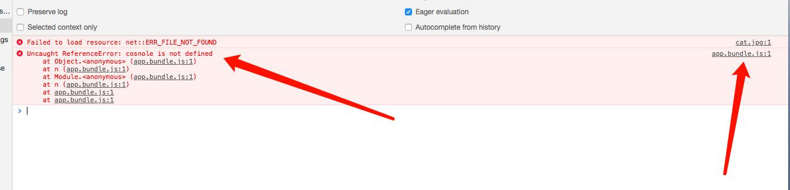
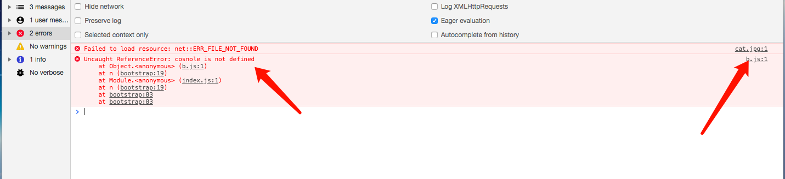

# Development

The tutorial for this folder comes from (https://webpack.js.org/guides/development/)[https://webpack.js.org/guides/development/]

## track error source by *source-map*

There are a lot of different options available when it comes to source maps.

- inline-source-map

In *webpack.config.js*,

```javascript
module.exports = {
  // some other code

  devtool: 'inline-source-map'
}
```

Without *source-map*, an error reported as following:

.

By providing *source-map*, an error reported more clearly as following:


